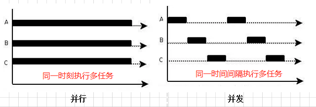
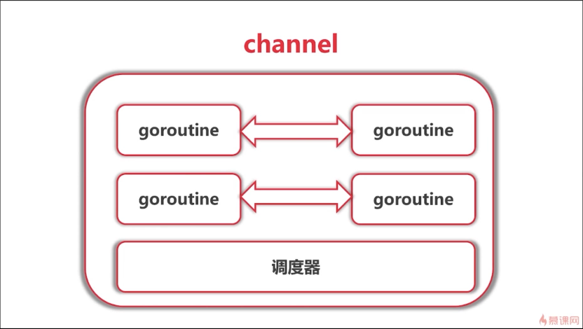

Go语言最大的特点就是并发编程，它实现了一种基于协程的并发模型。轻量级的协程模型减少了线程模型的切换消耗，大大增加了并发性能。他一句很出名的话就是：不要通过共享内存来通信，而应该**通过通信来共享内存。**

在了解go 并发之前，我们先区分一下并发和并行的概念：

### 并发和并行

并行(parallel)：指在同一时刻，有多条指令在多个处理器上同时执行。所以无论从微观还是从宏观来看，二者都是一起执行的。



并发(concurrency)：指在同一时刻只能有一条指令执行，但多个进程指令被快速的轮换执行，使得在宏观上具有多个进程同时执行的效果，但在微观上并不是同时执行的，只是把时间分成若干段，使多个进程快速交替的执行。

总的来说呢，就是：

> 并行是指两个或者多个事件在同一时刻发生；而并发是指两个或多个事件在同一时间间隔发生。

### 什么是`goroutine`

我们先看下面一个例子：

```tsx
func main() {
	for i := 0; i < 10; i++ {
		go func(j int) {
			for {
				fmt.Printf("Print num is %d \n", j)
			}
		}(i)
	}
	time.Sleep(time.Millisecond)
}
结果：
......
Print num is 3 
Print num is 3 
Print num is 0 
Print num is 0 
Print num is 2 
Print num is 2 
......
```

从上面的例子不难看出，在一个函数`func{}`前加一个`go `就可以开启一个`goroutine`了。

为了更好理解`Goroutine`,我们先理清一些概念：

**线程（Thread）**：有时被称为轻量级进程(Lightweight Process，`LWP`），是程序执行流的最小单元。一个标准的线程由线程ID，当前指令指针(PC），寄存器集合和堆栈组成。另外，线程是进程中的一个实体，是被系统独立调度和分派的基本单位，线程自己不拥有系统资源，只拥有一点儿在运行中必不可少的资源，但它可与同属一个进程的其它线程共享进程所拥有的全部资源。

线程拥有自己独立的栈和共享的堆，共享堆，不共享栈，线程的切换一般也由操作系统调度。

**协程（coroutine）**：和线程类似，共享堆，不共享栈，协程的切换一般由程序员在代码中显式控制。它避免了上下文切换的额外耗费，兼顾了多线程的优点，简化了高并发程序的复杂。总结来说，就是

- 轻量级：开1000个进程的话，操作系统可能是会受不了的，但是你开1000个协程的话，还是可以的
- 非抢占式的，由协程主动交出控制权。
- 编译器/解释器/虚拟机层面的多任务，不是操作系统层面的多任务
- 多个协程可能在一个或多个线程上运行

`Goroutine`和其他语言的协程（coroutine）在使用方式上类似，但从字面意义上来看不同（一个是`Goroutine`，一个是coroutine），再就是协程是一种协作任务控制机制，在最简单的意义上，协程不是并发的，而`Goroutine`支持并发的。

> 因此`Goroutine`可以理解为一种Go语言的协程。同时它可以运行在一个或多个线程上。

接下来看看go语言的调度器，当一个go程序开起来后，会有一个调度器，这个调度器负责调度go语言的协程，也就是`goroutine`


谁和谁在一个线程里运行，谁和谁分开等，都不用我们管，go调度器会帮我们控制

- 我们只需要在在任何函数前加上`go`就能送给调度器运行了
- 调度器会在合适的点进行切换（这些切换的点，我们并不能完全的控制）
- 使用`-race`来检测数据访问冲突

`goroutine`可能会切换的点：

- `I/O，select`
- `channel`
- 等待锁
- 函数调用（有时）
- `runtime.Gosched()`

那么`goroutine`协程之间是怎么通信的呢？怎么做到切换的呢？下面可以了解一下channel



### channel基础

怎么创建一个channel呢？简单：

```tsx
c := make(chan int)     //单个channel
c := make(chan int, 3)  //创建channel的buff缓冲
```

我们从例子：

```
func work(id int, c chan int) {
	for {
		fmt.Printf("work %d received %c \n", id, <-c)
	}
}
func chandemo() {
	var channels [10]chan int
	for i := 0; i < 10; i++ {
		channels[i] = make(chan int)
		go work(i, channels[i])  //消费channel
	}
	for i := 0; i < 10; i++ {    //产生channel
		channels[i] <- 'a' + i
	}
	time.Sleep(time.Millisecond)
}
func main() {
	chandemo()
}
结果:
work 1 received b 
work 9 received j 
work 5 received f 
work 7 received h 
work 4 received e 
work 6 received g 
work 3 received d 
work 8 received i 
work 0 received a 
work 2 received c 
```

**总之需要记住一点，有发就要有收。**

当然，遍历`channel`时，也可以使用`range`

```tsx
for n := range channel {}
```

`channel`的理论基础是`CSP`(Communicating Sequential Processes)模型，通过channel，我们可以更好的理解那句话：

> 不要通过共享内存来通信，而应该通过通信来共享内存。

### 使用channel进行通信

我们怎么进行进程间的通信，或者怎么等待完任务结束，不用`time.Sleep(time.Millisecond)`，优雅退出呢？

在等待多人任务结束时，go语言提供了一个库

```tsx
var wg sync.WaitGroup   //sync库
wg.Add()    //是add我们有多少个任务       |++
wg.Done()   //每个任务做完了，他们就要Done |--
wg.Wait()   //是等待任务做完，就结束       ok
```

我们可以看下面一段例子：

````tsx
type work struct {
	c  chan int
	wg *sync.WaitGroup
}
//如果不开for循环，则下面执行完10个任务之后，就会进入死锁状态
//也就是说，再执行完10给任务后，没有channel消费了，再对channel赋值的话，就会死锁
func doWork(id int, c chan int, wg *sync.WaitGroup) {
	for n := range c {  //如果不开循环，会怎么样呢？
		fmt.Printf("Worker %d received %c\n", id, n)
		wg.Done()  //Done,表示有一个任务做完了
	}
}
//开启任务，实例化channel
func createWorker(id int, group *sync.WaitGroup) work {
	w := work{
		make(chan int),
		group,
	}   //实例化channel
	go doWork(id, w.c, w.wg)    //开一个协程，即：打印字母的任务
	return w
}
func chanDemo() {
	var wg sync.WaitGroup
	var works [10]work
	for i := 0; i < 10; i++ {
		works[i] = createWorker(i, &wg)
	}
	//wg.Add(20)
	for i := 0; i < 10; i++ {
		wg.Add(1)
		works[i].c <- 'a' + i
	}
	wg.Wait()   //等待前面的10个任务做完，再做下面的任务
	fmt.Println("===========================")
	for i := 0; i < 10; i++ {
		wg.Add(1)
		works[i].c <- 'A' + i
	}
	wg.Wait()
}
//先并发打印10个小写字母，再并发打印10个大写字母
func main() {
	chanDemo()
}
````

另外，我们可以使用`select`来进行任务的调度


