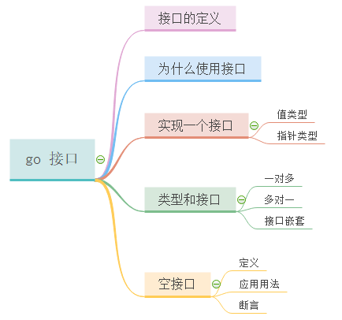

# 谈谈Go的Interface

在面试过程中，经常会被问道go的接口实现。在我们实际编程中，也会经常使用接口类型实现高效编程。那我们就来对go的interface一趟究竟吧。



### 什么是接口？

接口（interface）定义了一个对象的行为规范，只定义规范不实现，由具体的对象来实现规范的细节。

在Go语言中接口（interface）是一种类型，一种抽象的类型。

interface是一组method的集合，是duck-type programming的一种体现。接口做的事情就像是定义一个协议（规则），只要一台机器有洗衣服和甩干的功能，我就称它为洗衣机。不关心属性（数据），只关心行为（方法）。

> 为了保护你的Go语言职业生涯，请牢记接口（interface）是一种类型。

那为什么我们需要接口呢？

最简单的回答就是，为了不重复写代码。想一想，如何有一个方法，被重写了好多次，那代码看起来会有多么的繁琐。比如一个网上商城可能使用支付宝、微信、银联等方式去在线支付，我们能不能把它们当成“支付方式”来处理呢？

### 接口定义

```go
    type 接口类型名 interface{
        方法名1( 参数列表1 ) 返回值列表1
        方法名2( 参数列表2 ) 返回值列表2
        …
    }
```

> 只有当接口存储的类型和对象都为nil时，接口才等于nil。

其中：

```go
1.接口名：使用type将接口定义为自定义的类型名。Go语言的接口在命名时，一般会在单词后面添加er，如有写操作的接口叫Writer，有字符串功能的接口叫Stringer等。接口名最好要能突出该接口的类型含义。
2.方法名：当方法名首字母是大写且这个接口类型名首字母也是大写时，这个方法可以被接口所在的包（package）之外的代码访问。
3.参数列表、返回值列表：参数列表和返回值列表中的参数变量名可以省略。
```

例子：

```go
package main

import "fmt"

// Sayer 接口
type Sayer interface {
	say()
}

// 两个结构体
type cat struct{}
type dog struct{}

// cat实现了Sayer接口
func (c cat) say() {
	fmt.Println("喵喵喵")
}

// dog实现了Sayer接口
func (d dog) say() {
	fmt.Println("汪汪汪")
}

func main() {
	var x Sayer
	x = cat{}
	x.say() //输出喵喵喵
	x = dog{}
	x.say() //输出汪汪汪
}
```

接口的实现就是这么简单，只要实现了接口中的所有方法，就实现了这个接口。

接口类型变量能够存储所有实现了该接口的实例。 例如上面的示例中，Sayer类型的变量能够存储dog和cat类型的变量。

### 值接收者和指针接收者实现接口

我们经常看到在实现接口，或者使用结构体定义方法的时候，有传值类型的，也有传指针类型的，如：

```go
func (c *cat) say() {}
func (c cat) say() {}
```

使用值接收者实现接口和使用指针接收者实现接口有什么区别呢？

我们有一个Mover接口和一个dog结构体。

```go
type Mover interface {
    move()
}

type dog struct {}
```

#### 使用值接收者实现接口

```go
func (d dog) move() {
    fmt.Println("狗会动")
}
```

此时实现接口的是dog类型：

```go
func main() {
    var x Mover
    var wangcai = dog{} // 旺财是dog类型
    x = wangcai         // x可以接收dog类型
    var fugui = &dog{}  // 富贵是*dog类型
    x = fugui           // x可以接收*dog类型
    x.move()
}
//这两种方式赋值的话，都不会报错
```

从上面的代码中我们可以发现，使用值接收者实现接口之后，

> 不管是dog结构体还是结构体指针`*dog`类型的变量都可以赋值给该接口变量。

**因为Go语言中有对指针类型变量求值的语法糖，dog指针`fugui`内部会自动求值`*fugui`**。

#### 使用指针接收者实现接口

同样的代码我们再来测试一下使用指针接收者有什么区别：

```go
func (d *dog) move() {
    fmt.Println("狗会动")
}
func main() {
    var x Mover
    var wangcai = dog{} // 旺财是dog类型
    x = wangcai         // x不可以接收dog类型
    var fugui = &dog{}  // 富贵是*dog类型
    x = fugui           // x可以接收*dog类型
}
//这种方式，在赋值前不加&,会编译报错
```

此时实现Mover接口的是`*dog`类型，所以不能给x传入dog类型的`wangcai`，此时x只能存储`*dog`类型的值。

**总结**

- 使用值类型实现接口后，不管dog结构体实例化是指针型还是值类型。都可以赋值给该接口变量。因为go语言内部有对指针类型变量求值的语法糖。

- 使用指针型实现接口后，只能指针型变量赋值给接口变量。

### 类型与接口

类型和接口对应的关系有多种：

- 一个类型实现多个接口
- 多个类型实现同一接口
- 接口嵌套

`一个类型可以同时实现多个接口`这个好理解，就是类型的方法可以有多个，这些方法实现了多个接口。每个接口间彼此独立，不知道对方的实现。 例如，狗可以叫，也可以动。我们就分别定义Sayer接口和Mover接口

`多个类型实现同一接口`，就是不同的类型，可以实现同一个接口。比如我们定义一个Mover接口，它要求必须由一个move方法。当然，狗可以动，汽车也可以动。这就是多对一的情况。

并且一个接口的方法，不一定需要由一个类型完全实现，接口的方法可以通过在类型中嵌入其他类型或者结构体来实现。比如：

```go
// WashingMachine 洗衣机
type WashingMachine interface {
    wash()
    dry()
}

// 甩干器
type dryer struct{}

// 实现WashingMachine接口的dry()方法
func (d dryer) dry() {
    fmt.Println("甩一甩")
}

// 海尔洗衣机
type haier struct {
    dryer //嵌入甩干器
}

// 实现WashingMachine接口的wash()方法
func (h haier) wash() {
    fmt.Println("洗刷刷")
}
```

接口与接口间也可以通过嵌套创造出新的接口：

```go
// Sayer 接口
type Sayer interface {
    say()
}

// Mover 接口
type Mover interface {
    move()
}

// 接口嵌套
type animal interface {
    Sayer
    Mover
}
```

### 空接口

#### 空接口的定义

空接口是指没有定义任何方法的接口。因此任何类型都实现了空接口。

空接口类型的变量可以存储任意类型的变量。

#### 空接口的应用

> 空接口作为函数的参数

使用空接口实现可以接收任意类型的函数参数。

```go
// 空接口作为函数参数
func show(a interface{}) {
    fmt.Printf("type:%T value:%v\n", a, a)
}
```

> 空接口作为map的值

使用空接口实现可以保存任意值的字典。

```go
// 空接口作为map值
    var studentInfo = make(map[string]interface{})
    studentInfo["name"] = "李白"
    studentInfo["age"] = 18
    studentInfo["married"] = false
    fmt.Println(studentInfo)
```

#### 类型断言

空接口可以存储任意类型的值，那我们如何获取其存储的具体数据呢？

想要判断空接口中的值这个时候就可以使用类型断言，其语法格式：

```
    x.(T)
```

其中：

```
    x：表示类型为interface{}的变量
    T：表示断言x可能是的类型。
```

该语法返回两个参数，第一个参数是x转化为T类型后的变量，第二个值是一个布尔值，若为true则表示断言成功，为false则表示断言失败。

### 参考文献

- [go语言中文文档](http://www.topgoer.com/面向对象/接口.html)

- [面向对象编程：接口与多态](https://mp.weixin.qq.com/s/V6fdiRXpLqI9W_B0q_dhlg)