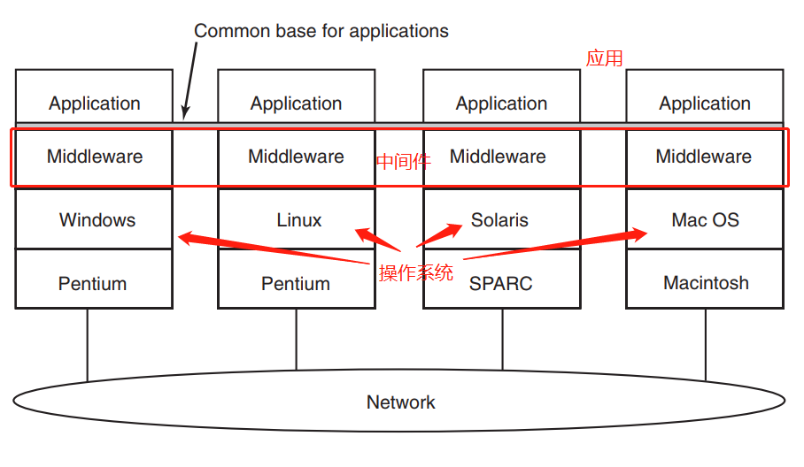

# RPC基本原理和框架

RPC 远程服务调用是分布式服务架构的基础，无论微服务设计上层如何发展，讨论服务治理都绕不开远程服务调用。远程过程调用，作为分布式系统的中间件，起着非常重要的作用。

这里说一下中间件的重要性，参看下图,是分布式系统的基本交互架构：

> 分布式系统面对不同硬件和操作系统实现某种统一性的途径是，在操作系统的顶部添加一层软件，这层软件就称为中间件。中间件提供了一些特点的数据结构和操作，从而允许散布的机器上的进程和用户用一致的方式互操作。

RPC就是实现这样的一种中间件，这就是为什么要使用RPC，以及RPC的重要性。当然，这只是其中的原因之一。

### 什么是RPC

RPC（Remote Procedure Call）是一种进程间通信方式，百科给出的定义是这样的：“RPC（远程过程调用协议），它是一种通过网络从远程计算机程序上请求服务，而不需要了解底层网络技术的协议”。

RPC 允许程序调用另一个地址空间的过程或函数，而不用程序员显式编码这个远程调用的细节。即无论是调用本地接口/服务的还是远程的接口/服务，本质上编写的调用代码基本相同。

比如两台服务器 A、B，一个应用部署在 A 服务器上，想要调用 B 服务器上应用提供的函数或者方法，由于不在一个内存空间，则不能直接调用，这时候就可以应用 RPC 框架的实现来解决。

### RPC框架

开源社区里有许多优秀的 RPC 框架，比如常用的 Dubbo、Thrift、gRPC 等，下面简单介绍一下这几款组件。

#### Apache Dubbo

Dubbo 是阿里巴巴公司开源的一个高性能 Java 分布式服务框架，目前已经成为 Apache 顶级项目。Dubbo 可以通过高性能的 RPC 实现服务的输出和输入，支持服务治理，提供了控制台界面，可以独立应用，也可以和 Spring 框架无缝集成。

Dubbo 在设计中采用了微内核架构，基于对 `Java SPI` 机制的扩展实现，Dubbo 对分布式服务调用核心功能都开放了扩展点，包括服务调用的负载均衡策略、序列化协议、传输协议等，使用者都可以添加自定义实现。

Dubbo 在国内曾经拥有很高的人气，是微服务架构的首选，后来随着 Spring Cloud 的流行，社区一度停更，外部用户发布了 `DubboX` 等升级版本。最近，Dubbo 社区又重新活跃，更新后的 Dubbo 也发布了 3.0 预览版等，并且宣布会在未来的版本中支持更多特性，值得期待。

#### Google 的 gRPC

gRPC 是 Google 开发的高性能、通用的开源 RPC 框架，gRPC 使用 `ProtoBuf` 来定义服务，`ProtoBuf `是 Google 开发的一种数据序列化协议，性能比较高，压缩和传输效率高，语法也比较简单。另外，gRPC 支持多种语言，并能够基于语言自动生成客户端和服务端功能库。

#### Apache Thrift

Thrift 起源于` Facebook`，和 Dubbo 一样，后来被提交 Apache 基金会将 Thrift 作为一个开源项目。`Facebook `创造 Thrift 的目的是为了解决 `Facebook` 各系统间大数据量的传输通信，以及系统间语言环境不同需要跨平台的问题。

Thrift 支持多种编程语言，如 Java、C++、Python、PHP、Ruby 等，可以在多种不同的语言之间通信。应用 Thrift，需要在一个语言无关的 `IDL` 文件里，定义数据类型和服务接口，然后生成用来构建 RPC 客户和服务器所需的代码。

Thrift 主要的优点是跨语言；缺点是，由于需要定义独立的 `IDL` 文件，如果对服务进行修改，当数据结构发生变化时，必须重新编辑` IDL `文件、重新编译和生成相关的代码，修改起来比较繁琐。

#### 微博 Motan

Motan 是新浪微博开源的一个 Java RPC 框架，官方文档对外宣传在微博平台已经广泛应用，每天为数百个服务完成近千亿次的调用。

Motan 基于 Java 语言开发，设计和实现与 Dubbo 比较类似，包括服务提供者（RPC Server）、服务调用方（RPC Client）、服务注册中心（Registry）三个角色。服务端会向注册中心注册服务，消费端使用服务需要先向注册中心进行订阅，根据注册中心的返回列表与具体的 服务端建立连接，进行 RPC 通讯。当服务端发生变更的时候，注册中心也会同步变更，然后同步的通知到消费端。

Motan 也提供了服务治理的功能，包括服务的发现、服务的摘除、高可用及负载均衡。

### gRPC基本原理

**这里，我们重点来分析一下gRPC的基本原理**

gRPC 是一个高性能、开源和通用的 RPC 框架，面向移动和 HTTP/2 设计。目前提供 C、Java 和 Go 语言版本，分别是：`grpc`, `grpc-java,` `grpc-go`。 其中 C 版本支持 C, C++, `Node.js`, Python, Ruby, Objective-C, `PHP` 和 C# 支持。

gRPC 基于 HTTP/2 标准设计，带来诸如双向流、流控、头部压缩、单 TCP 连接上的多复用请求等特性。这些特性使得其在移动设备上表现更好，更省电和节省空间占用。

#### gRPC的调用模型

1. 客户端（gRPC Stub）调用 A 方法，发起 RPC 调用。
2. 对请求信息使用 Protobuf 进行对象序列化压缩（`IDL`）。
3. 服务端（gRPC Server）接收到请求后，解码请求体，进行业务逻辑处理并返回。
4. 对响应结果使用 Protobuf 进行对象序列化压缩（`IDL`）。
5. 客户端接受到服务端响应，解码请求体。回调被调用的 A 方法，唤醒正在等待响应（阻塞）的客户端调用并返回响应结果。

### 为什么有了HTTP，还需要RPC呢？

### 参考文献

- [RPC原理以及GRPC详解](https://www.cnblogs.com/awesomeHai/p/liuhai.html)

- [从实践到原理，带你参透 gRPC](https://www.cnblogs.com/sunsky303/p/11119300.html)

- [比较 gRPC 服务和 HTTP API](https://docs.microsoft.com/zh-cn/aspnet/core/grpc/comparison?view=aspnetcore-3.0&viewFallbackFrom=aspnetcore-2.1)

