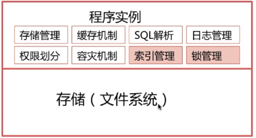

# 关系型数据库基本架构

一般，关系型数据库的主要考点如下：


### 如何设计一个关系型数据库？

当面试时，面试官问你如何设计一个关系型数据库，你的脑海中会浮现什么样的架构图呢？面试官想看到我们设计系统的能力和对数据库的了解度。

万变不离其宗，设计一个数据库和设计一款软件差不多，都是模块划分。现在开始我们的设计：


1. 存储（文件系统）

负责存储我们的数据，就类似我们的OS文件系统，将文件最终持久化存入我们的磁盘中，如机械硬盘或SSD固态硬盘。

可是，光有存储是不够的。我们需要对存储进行管理和操作。


存储管理

这里，我们需要考虑到文件存储和查询的优化。我们处理数据不是在磁盘中，而是加载到内存当中去处理的。所以，I/O索引是程序执行的主要瓶颈。所以，我们应该尽量减少读取I/O，一次的I/O读取多条数据和单条数据耗时差不多。




### 索引模块

常见问题：

- 为什么要使用索引
- 什么样的信息能成为索引
- 索引的数据结构
- 密集索引和稀疏索引的区别

一种查询数据的方式，最简单的就是全表扫描。将整张表的数据，全部或分批次加载到内存中，将这些块（页）加载到内存中后，去轮询查找。这只适合数据量少的情况下。

更高效的方式：索引。来源于字典。


成为索引：关键字、主键等


索引数据结构：

- 二叉树
- B-Tree和B+Tree
- Hash结构查询


### 主键和外键

## **外键**

### **外键的定义**

> 如果**公共关键字**在一个关系中是**主关键字**，那么这个**公共关键字**被称为另一个关系的**外键**。由此可见，外键表示了两个关系之间的相关联系。以另一个关系的外键作主关键字的表被称为主表，具有此外键的表被称为主表的从表。外键又称作外关键字。

**举例：**

student表：


class表：


由于一个班级可以有多个学生，在关系模型中，这两个表的关系可以称为“一对多”，即一个`class`的记录可以对应多个`student`表的记录。

为了表达这种一对多的关系，我们需要在`student`表中加入一列`class_id`，让它的值与`class`表的某条记录相对应。

这样，我们就可以根据`class_id`这个列直接定位出一个`student`表的记录应该对应到`class`的哪条记录。

在`student`表中，通过`class_id`的字段，可以把数据与另一张表关联起来，这种列称为`外键`。

外键并不是通过列名实现的，而是通过定义外键约束实现的：

```mysql
//定义外键约束
ALTER TABLE student
ADD CONSTRAINT fk_class_id  //外键约束的名称fk_class_id可以任意
FOREIGN KEY (class_id)     //指定了class_id作为外键
REFERENCES class (id);    //指定了这个外键将关联到class表的id列（即class表的主键）
```

> class_id为学生表的外键。（此时`student`表中的class_id与`class`表中的id表示的含义相同）
> 此时外键表是`student`表，主键表是`class`表。

要删除一个外键约束，也是通过`ALTER TABLE`实现的：

```mysql
ALTER TABLE student
DROP FOREIGN KEY fk_class_id;
```

> 由于外键约束会降低数据库的性能，大部分互联网应用程序为了追求速度，并不设置外键约束，而是仅靠应用程序自身来保证逻辑的正确性。这种情况下，`class_id`仅仅是一个普通的列，只是它起到了外键的作用而已。